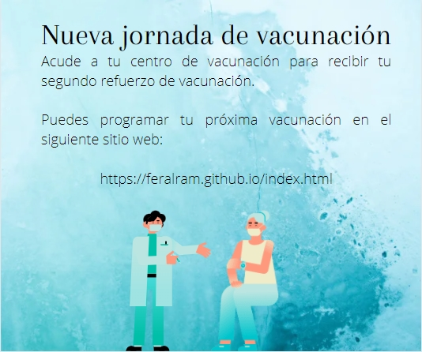

# Practica de css: Replicar sitio web

El siguiente repositorio contiene los archivos de un sitio web estatico, el cual es el resultado de clonar una plantilla, que es la imagen que se muesta a continuación. El sitio esta optimizado para las siguientes resoluciones 1864px hasta los 1400px en ancho de pantalla.

En el siguiente repositorio se puede encontrar los archivos del sitio web estatico resultado de la practica de CSS el cual constaba de replicar el sitio web solicitado lo mas apegado posible a lo que se mostraba en la imagen y una pequeña planificacion de campaña de vacunación.

[Link del sitio web de vacunación](https://feralram.github.io)

[Ejemplo a replicar](https://github.com/LaunchX-InnovaccionVirtual/FrontEnd-Mision/blob/main/03%20-%20CSS/practica/landingVacunación.png)
